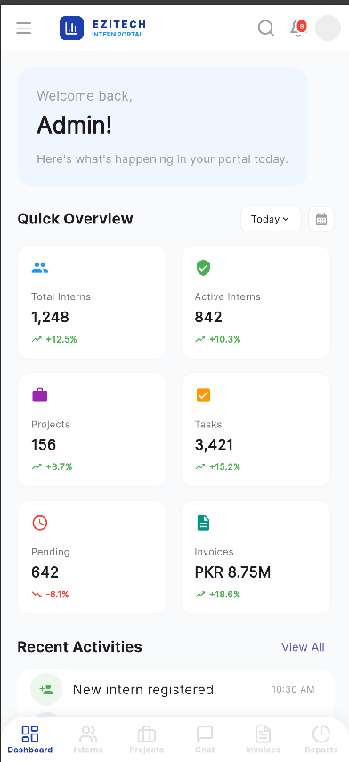
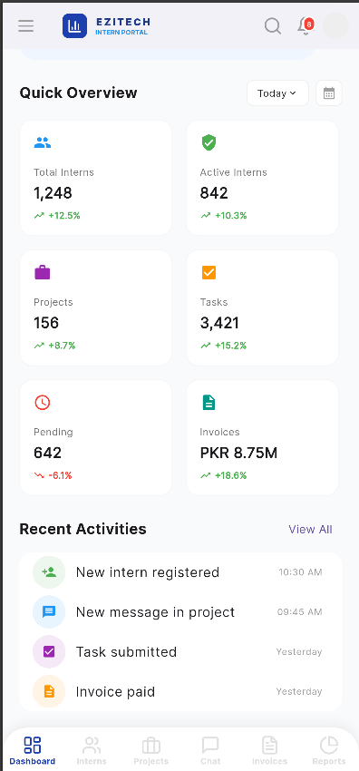
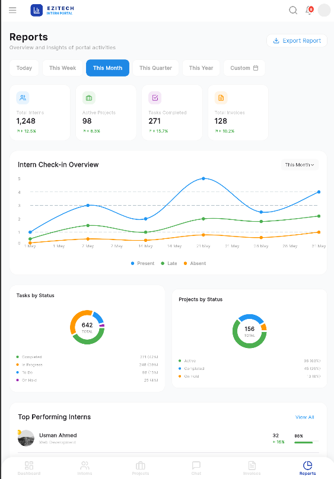
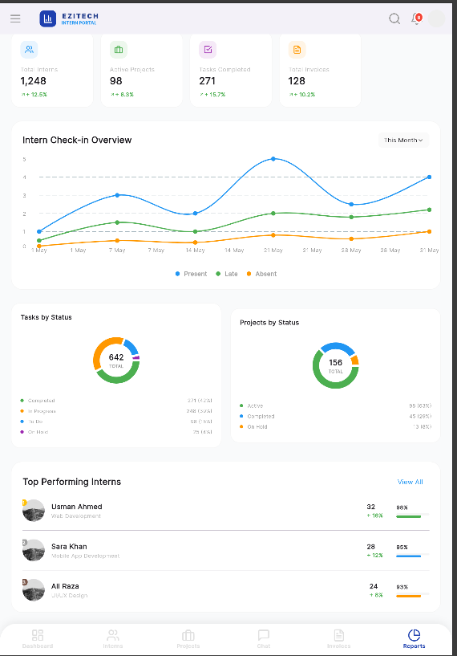
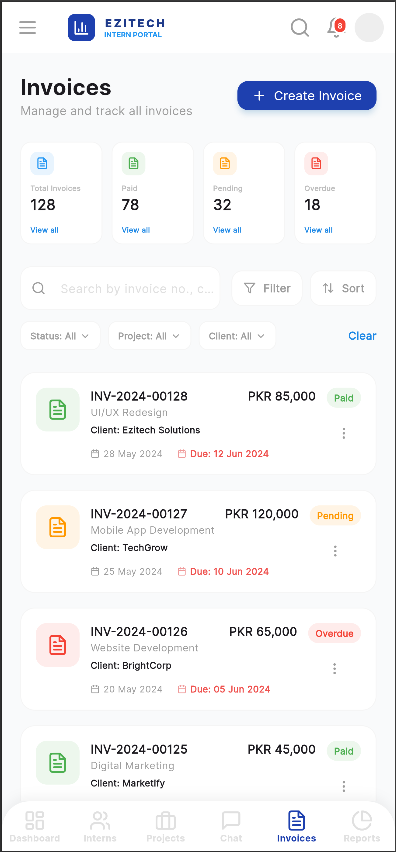
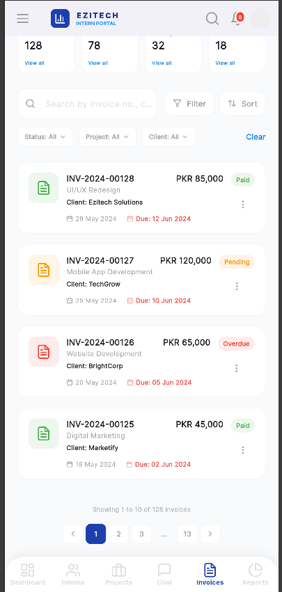

# 📱 Ezitech Internship Management Portal

[](https://flutter.dev)
[](https://m3.material.io)
[](LICENSE)

A high-fidelity, feature-rich Flutter application designed for managing internships at **Ezitech Solutions**. This portal serves as a central hub for admins to track intern progress, manage projects, and handle financial reporting.

---

## ✨ Key Modules

- **📊 Management Dashboard**: Real-time overview of key performance indicators (KPIs).
- **📉 Advanced Reporting**: Integrated `fl_chart` analytics for intern check-ins and project health.
- **👨‍🎓 Intern Tracking**: Comprehensive table-view for monitoring task completion and rank-based leaderboards.
- **🧾 Invoice System**: Full-cycle invoice management with status tracking (Paid/Pending/Overdue).
- **💬 Collaboration Hub**: Real-time chat module for project-specific discussions.

---

## 📸 Visual Interface

### Dashboard View

| Dashboard |
| :---: |
| <br> |

---

### Reports & Analytics

| Reports |
| :---: |
| <br> |

---

### Invoices List

| Invoices |
| :---: |
| <br> |
## 🛠️ Technical Implementation

### Core Built With
- **Language**: [Dart](https://dart.dev/)
- **Framework**: [Flutter](https://flutter.dev/)
- **Typography**: [Google Fonts (Inter)](https://fonts.google.com/specimen/Inter)
- **Icons**: [Lucide Icons](https://lucide.dev/)
- **Charts**: [FL Chart](https://pub.dev/packages/fl_chart)

### Project Architecture
```text
lib/
├── main.dart            # Application entry point & theme configuration
├── pages/               # Functional UI Modules
│   ├── dashboard_page.dart  # KPI cards and activity feeds
│   ├── reports_page.dart    # Charts, Analytics, and Leaderboards
│   └── invoices_page.dart   # Financial tracking and management
└── components/          # Reusable UI widgets (Buttons, Cards, Badges)
```

---

## 🚀 Installation & Setup

### Prerequisites
- Flutter SDK (v3.0.0 or higher)
- Android Studio / VS Code with Flutter extension

### Steps
1. **Clone the repository**
   ```bash
   git clone https://github.com/msaadirfan/EZITECH_intern_portal.git
   cd EZITECH_intern_portal
   ```

2. **Install dependencies**
   ```bash
   flutter pub get
   ```

3. **Launch the application**
   ```bash
   # Run on connected device
   flutter run
   ```

---

## 📂 Handling Screenshots
To make the README images visible on your GitHub profile:
1. Create a `screenshots/` directory in the root.
2. Place your PNG/JPG files inside.
3. Ensure the filenames match the links in this README (e.g., `dashboard.png`).

---

## 👨‍💻 Author
**M. Saadi Irfan**  
*Front-end Developer & Flutter Enthusiast*

---

## 📄 License
This project is licensed under the MIT License - see the [LICENSE](LICENSE) file for details.
